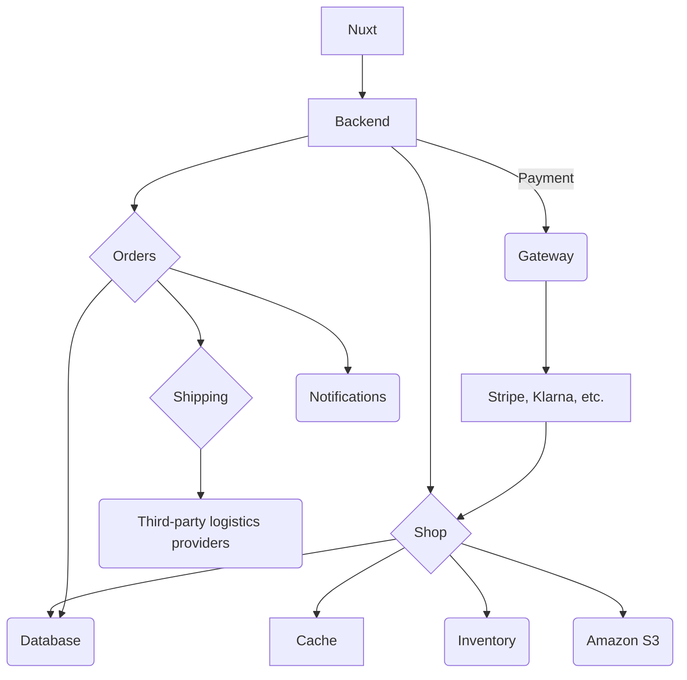
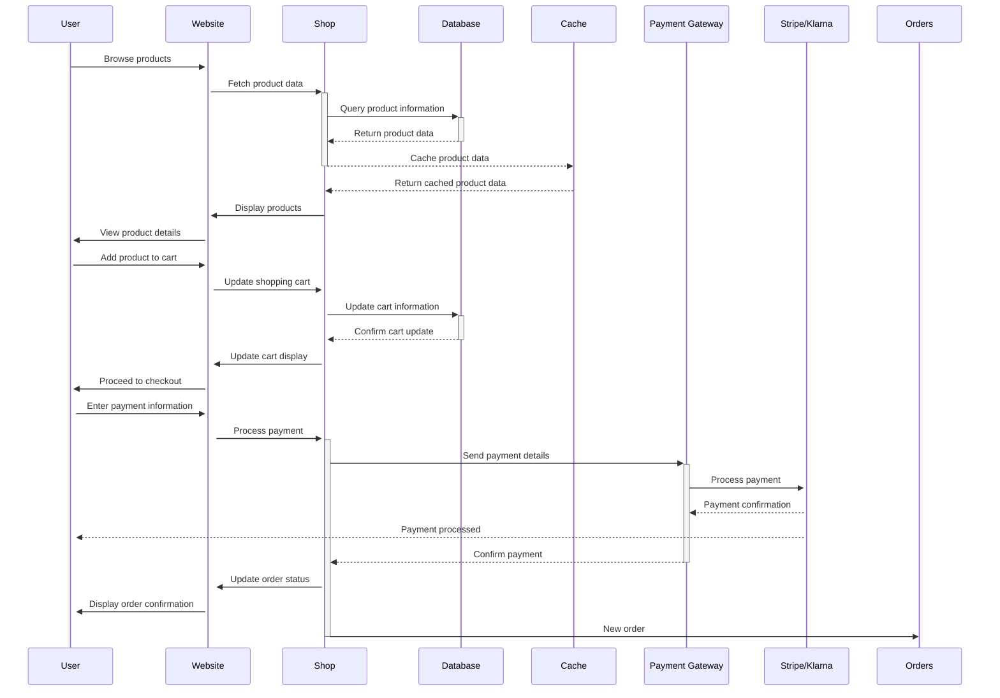
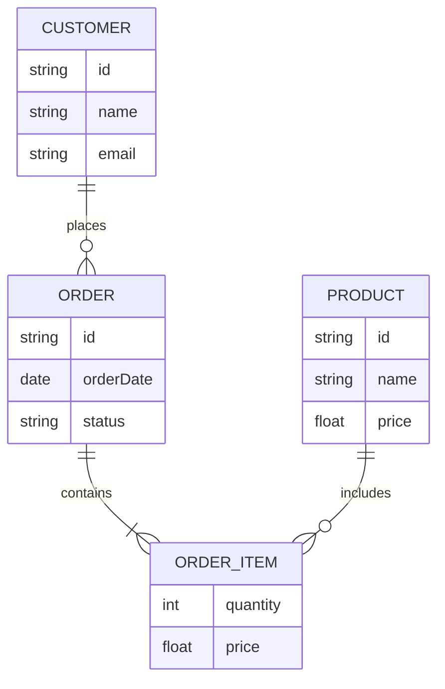

# Fullstack

## Requirements & Assumptions

### Clarifying Questions

Questions that need to be answered to better understand the requirements and constraints of the system. Examples of clarifying questions for an E-commerce application:

- **Channels** Mobile ? Web ?
- **Payment Methods** Credit Card ? PayPal ? Apple Pay ?
- **User Authentication** Email/Password ? Social Login ?
- **Inventory Management** Real-time ? Batch updates ?
- **Shipping** Integration with third-party logistics providers ? In-house fulfillment ?
- **Inventory**
  * How many products will the system need to handle ?
  * How frequently will the product catalog be updated ?
  * In-house inventory management or integration with third-party inventory systems ?
  * What types of products will be sold (e.g., physical goods, digital products, services) ? Do they have different variants (e.g., size, color) ?
- **Reviews** Will the system allow customers to leave reviews and ratings for products ? If so, how will these reviews be moderated and displayed on the product pages ?

### Functional Requirements

Describes the specific features and functionalities that the system must provide. For example for an E-commerce application:

- **Admin** Dashboard for managing products, orders, and users.
- **Search** Allows users to search for products based on various criteria such as name, category, price, etc.
- **Shopping Cart & Checkout** Allows users to add products to their shopping cart for purchase, can add and purchase multiple products.
- **Payment Processing** Integrates with payment gateways to securely process payments from customers. Prevent double payment and ensure secure transactions.
- **Order Management** Allows users to view their order history and track the status of their orders.

## Capacity Planning

### Database

Estimates the expected load on the system, such as the number of users, transactions, or requests per second. This helps in designing a system that can handle the anticipated traffic and scale as needed. For example:

For example, Bershka gets **18.9 million** visits per month:

- **Yearly** 227 million visits
- **Daily** 621,000 visits
- **Hourly** 25,875 visits
- **Per Second** 7.2 visits approximate database queries per second that the database needs to handle.

### Storage

On the S3 storage end, and image size in `webp` format is around 100KB. An e-commerce website like Bershka has around 100,000 products, which means that the total storage required for product images would be approximately 10GB (100KB * 100,000 products). This is a manageable amount of storage for Amazon S3, which can easily scale to accommodate larger amounts of data as needed.

- **Images** 100KB x 100,000 products
- **Estimate storage** 10GB of storage required for product images.

## High Level Architecture

Describes the overall structure of the system, including the main components and how they interact with each other. This can be illustrated using diagrams such as component diagrams or architecture diagrams.

## System Workflow

Explains the sequence of interactions between different components of the system, such as how a user request flows through the application, how data is processed, and how responses are generated. This can be illustrated using sequence diagrams or flowcharts.

## Api Design

Describes the design of the APIs that will be used for communication between different components of the system, such as the frontend and backend. This includes the endpoints, request and response formats, authentication mechanisms, and any other relevant details about how the APIs will function.

Example:

| Endpoint        | Method | Description                            | Request Body                                      | Response Body                         |
| --------------- | ------ | -------------------------------------- | ------------------------------------------------- | ------------------------------------- |
| /products       | GET    | Retrieve a list of products            | None                                              | List of products with details         |
| /products/{id}  | GET    | Retrieve details of a specific product | None                                              | Product details                       |
| /cart           | POST   | Add a product to the shopping cart     | { productId: string, quantity: number }           | Updated shopping cart details         |
| /checkout       | POST   | Process the checkout and payment       | { cartId: string, paymentInfo: object }           | Order confirmation and details        |
| /orders         | GET    | Retrieve a list of user orders         | None                                              | List of user orders with details      |
| /orders/{id}    | GET    | Retrieve details of a specific order   | None                                              | Order details                         |
| /users/register | POST   | Register a new user                    | { name: string, email: string, password: string } | User registration confirmation        |
| /users/login    | POST   | Authenticate a user                    | { email: string, password: string }               | Authentication token and user details |

Determines also whete the system will be using RESTful APIs or GraphQL, and how the frontend will interact with these APIs to fetch and manipulate data.

If the system uses microservices architecture, the API design will also include details about how different microservices will communicate with each other, such as using RESTful APIs, gRPC, or message queues.

## Data storage

Describes how the system will store and manage data, including the choice of database (e.g., relational, NoSQL), data models, and how data will be accessed and manipulated by the application.

### Amazon S3

Explains the the manner in which the system will use Amazon S3 for storing and retrieving files, including the structure of the S3 buckets, access control policies, and how the application will interact with S3 for file uploads and downloads.

### Database

Explains the choice of database (e.g., relational, NoSQL) and how it will be used to store and manage data for the application. This includes the data models, relationships between entities, and how the application will perform CRUD (Create, Read, Update, Delete) operations on the database.

## Caching

Describes the caching strategy for the application, including what data will be cached, how it will be cached (e.g., in-memory cache, distributed cache), and how the cache will be invalidated when data changes. For example, product data that is frequently accessed but infrequently updated can be cached to improve performance and reduce load on the database.

## Scalability

Describes how the system will be designed to handle increasing loads and scale as needed. This includes strategies for horizontal scaling (adding more servers) and vertical scaling (upgrading existing servers), as well as any load balancing techniques that will be used to distribute traffic across multiple servers.
