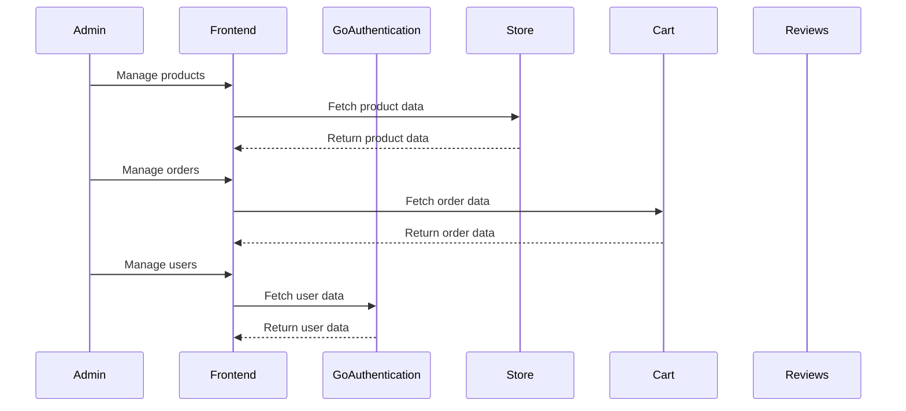

# Admin 🚀

The admin Nuxt 4 project serves as the backend management interface for the e-commerce website. It is designed to provide administrators with tools to manage products, orders, users, and other aspects of the platform efficiently.

This admin panel exists as a centralized dashboard that reunites the functionalities of the Django initial admin panels.

## Key Features ✨

- **Product Management**: Add, update, and delete products in the catalog.
- **Order Management**: View and manage customer orders.
- **User Management**: Manage user accounts and permissions.
- **Analytics Dashboard**: View sales and user activity metrics.
- **Responsive Design**: Ensures a consistent experience across devices.

## Technologies Used 🌳

| Technology            | Purpose/Usage                  | Version   |
|-----------------------|-------------------------------|------------|
| Nuxt 4                | Frontend framework            | ✅ 4.X     |
| Firebase              | Authentication, database      | ✅ -       |
| AWS S3                | Static and media storage      | ✅ -       |
| Cloudfront            | CDN for static files          | ✅ -       |
| Google Analytics      | Traffic analysis              | ✅ -       |
| Facebook Pixels       | Traffic analysis              | ✅ -       |
| Microsoft Clarity     | Traffic analysis              | ✅ -       |

## Architecture 🏗

