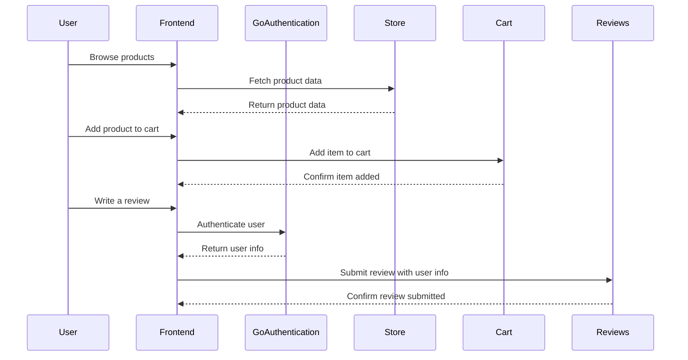

# Mainsite 🚀

The mainsite Nuxt 4 project serves as the frontend for both the desktop and mobile versions of the e-commerce website. It is designed to provide a seamless shopping experience for users, with a focus on performance and responsiveness.

## Key Features ✨

- **Dynamic Product Catalog**: Fetches product data from the Store micro-service and displays it in an engaging way.
- **User Authentication**: Integrates with the GoAuthentication micro-service for secure user login and registration.
- **Shopping Cart**: Connects to the Cart micro-service to manage user carts and checkout processes.
- **Reviews and Ratings**: Displays product reviews and ratings fetched from the Reviews micro-service.
- **Responsive Design**: Ensures a consistent user experience across desktop and mobile devices.

## Technologies Used 🌳

| Technology            | Purpose/Usage                  | Version   |
|-----------------------|-------------------------------|------------|
| Nuxt 4                | Frontend framework            | ✅ 4.X     |
| Ionic                 | Mobile application framework  | ✅ 7.X     |
| Stripe                | Payment processing            | ✅ -       |
| Klarna                | Payment processing            | ✅ -       |
| Firebase              | Authentication, database      | ✅ -       |
| AWS S3                | Static and media storage      | ✅ -       |
| Cloudfront            | CDN for static files          | ✅ -       |
| Google Analytics      | Traffic analysis              | ✅ -       |
| Facebook Pixels       | Traffic analysis              | ✅ -       |
| Microsoft Clarity     | Traffic analysis              | ✅ -       |

## Architecture 🏗

