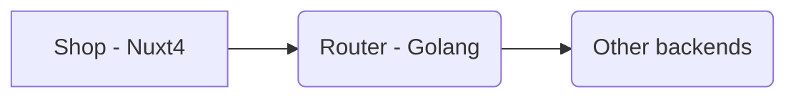
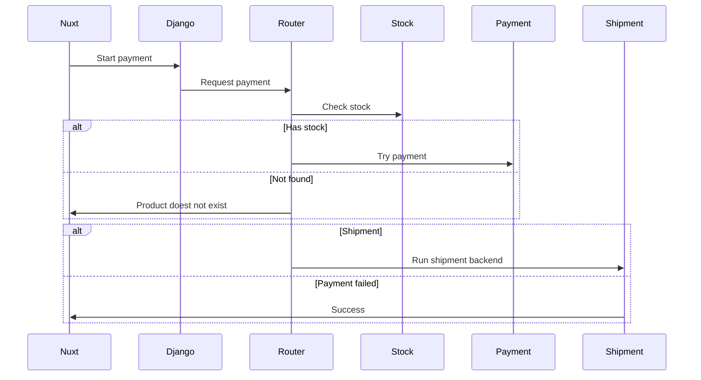

# Go Purchase Micro-Service 🎹

The purchase micro-service is a Golang server that accepts purchase requests from Nuxt 4 and syncs the purchase details with any backends decided by the developer. The reasoning behind this service is to allow the developer to implement any stock tracking backend and payment mechanism with the main shop interface.

## Process

1. When the user adds product in their cart, a payment intent is created. This payment intent is used to track the user during the shopping process

## Implementation & architecture

Here is the simplest technical implementation of how a payment process could take place:

Here is the detailed implementation of the payment process:

## Resources

* Stripe test cards [Stripe](https://docs.stripe.com/testing?testing-method=payment-methods#visa "Test cards")
