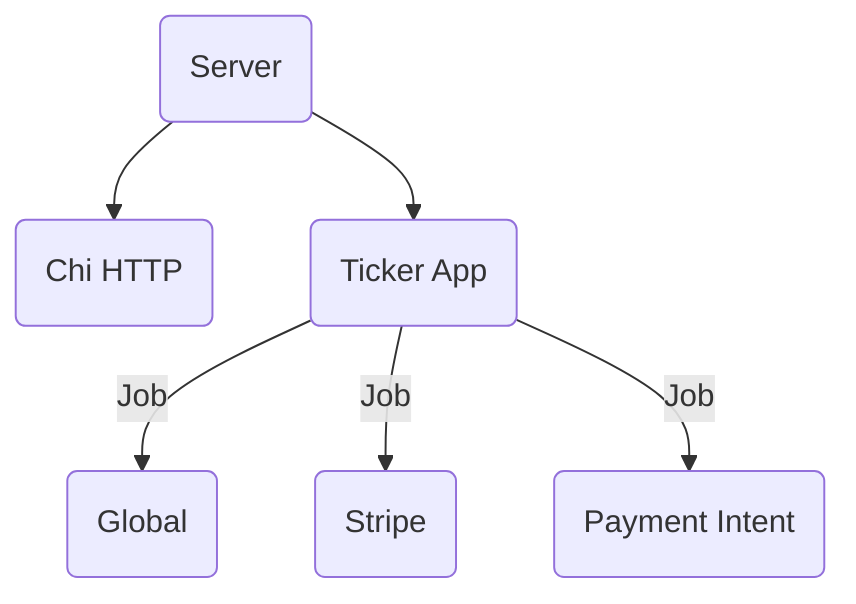
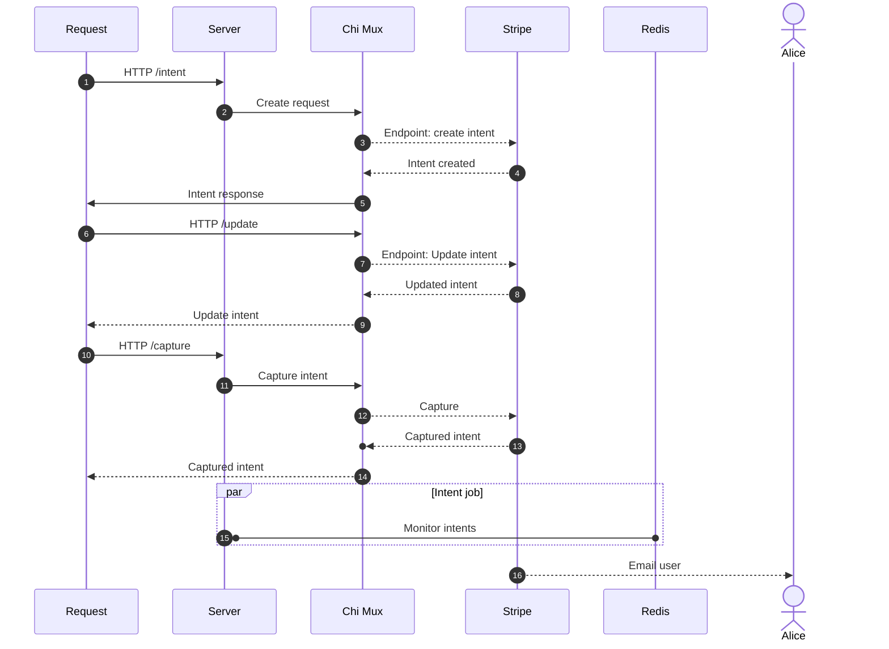

# Go Purchase Micro-Service 🎹

The purchase micro-service is a Golang server that accepts purchase requests from Nuxt 4 and syncs the purchase details with any backends decided by the developer. The reasoning behind this service is to allow the developer to implement any stock tracking backend and payment mechanism with the main shop interface.

## Endpoints

| Endpoint | Method | Description                         | Request Body                                    | Response Body                              |
| -------- | ------ | ----------------------------------- | ----------------------------------------------- | ------------------------------------------ |
| /create  | POST   | Creates a new payment intent        | {sessionId string, total: int, items: object[]} | {paymentIntentId: string, message: string} |
| /update  | POST   | Updates a created payment intent    | {}                                              | {}                                         |
| /capture | POST   | Captures the payment for the intent | {paymentIntentId: string}                       | {}                                         |

## Process

1. When the user adds product in their cart, a payment intent is created. This payment intent is used to track the user during the shopping process

## Implementation & architecture

Here is the simplest technical implementation of how a payment process could take place:

```mermaid
flowchart

S(Server) --> C(Chi HTTP)
S --> T(Ticker App)
T --> |Job|G(Global)
T --> |Job|ST(Stripe)
T --> |Job|P(Payment Intent)
```

The main server is a loop that manages the main HTTP server for accepting incoming requests and a ticker application that runs jobs in the background.

The Ticker application runs three jobs in the background:

* Global job: This job is responsible for running any global tasks that need to be performed periodically. It can be used for tasks such as cleaning up old data, sending notifications, or performing other maintenance tasks.
* Stripe job: This job is responsible for checking the status of the Stripe api endpoint
* Payment Intent job: This job is responsible for checking the status of payment intents and distributing the payment inforamtion to webhooks and other services that need to be notified of the payment status.

Here is the detailed implementation of the payment process:

* Resources
* Stripe test cards [Stripe](https://docs.stripe.com/testing?testing-method=payment-methods#visa "Test cards")

```mermaid
sequenceDiagram

autonumber

participant R as Request
participant S as Server
participant C as Chi Mux
participant ST as Stripe
participant RE as Redis

actor U as Alice

R ->> S: HTTP /intent

S ->> C: Create request
C -->> ST: Endpoint: create intent
ST -->> C: Intent created
C ->> R: Intent response

R ->> C: HTTP /update
C -->> ST: Endpoint: Update intent
ST -->> C: Updated intent
C -->> R: Update intent

R ->> S: HTTP /capture
S ->> C: Capture intent
C -->> ST: Capture
ST -->> ()C: Captured intent
C -->> R: Captured intent

par Intent job
S() -> ()RE: Monitor intents
end

ST -->> U: Email user
```
