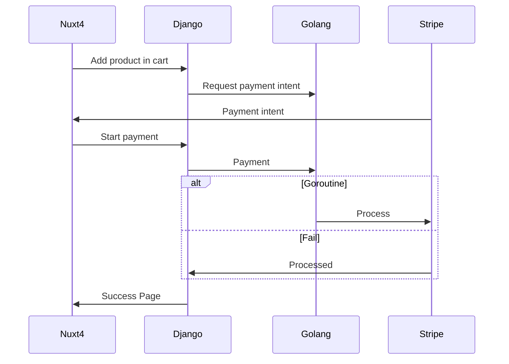
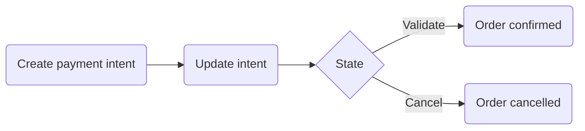

## Cart micro-service 💳

This Django application is responsible for managing the shopping cart functionality in the e-commerce platform. It allows users to add, remove, and update products in their cart, as well as view the contents of their cart and proceed to checkout (see [How it works](#how-it-works)).

## Architecture

### Golang

This architecture diagram illustrates the interaction between the Nuxt4 frontend, the Django backend, the Golang service responsible for processing payments, and Stripe as the payment gateway. The sequence of events is as follows:



The Golang service is responsible for processing the payment with Stripe. It runs as a separate service and communicates with the Django backend to receive payment requests and send back the results of the payment processing.

The Django backend handles the business logic of the application, including managing the shopping cart and interacting with the database, while the Nuxt4 frontend provides the user interface for the shopping cart and checkout process.

Payments are processed asynchronously to ensure a smooth user experience.

### Django

The Django application does also include a payment processing module that is responsible for handling the payment process directly with Stripe without delegating to Golang. This module is designed to work asynchronously, allowing the application to continue functioning while the payment is being processed.

#### Payment Processing Flow

Globally speaking, the payment processing flow can be visualized as follows:



It starts with creation of a payment intent as early as possible (e.g. when the user adds a product to the cart). The payment intent is then updated all throughout the payment process (e.g. when the user adds shipment information). Finally, it is either confirmed or cancelled.

## Technologies Used 🌳

| Technology            | Purpose/Usage              | Version  |
| --------------------- | -------------------------- | -------- |
| Django                | Web framework              | ✅ 3.x   |
| Django REST Framework | API development            | ✅ 3.x   |
| PostgreSQL            | Database                   | ✅ 13    |
| Redis                 | Caching, message broker    | ✅ 6.x   |
| RabbitMQ              | Message broker             | ✅ 3.8.x |
| Celery                | Task queue/background jobs | ✅ 5.x   |
| Docker                | Containerization           | ✅ 20.x  |
| Stripe                | Payment processing         | ✅ 8.x   |

## Features ⭐

- User authentication and authorization
- Product catalog management
- Shopping cart functionality
- Order processing and management
- Payment integration
- API documentation with Swagger

## How it works ⚙️

When the user is about to pay, Nuxt will require the user to be either logged in or to create an account.

Nuxt will then call for a [payment intent](https://docs.stripe.com/api/payment_intents) to Stripe. The payment intent will get
updated all throughout the payment process (with shipment information for example).

## Starting the MCP inspector

This application comes with an MCP server that allows admins and authorized users to run tasks on the databases of the application.

```bash
npx @modelcontextprotocol/inspector uv --directory /path/to/directory run python manage.py stdio_server
```
